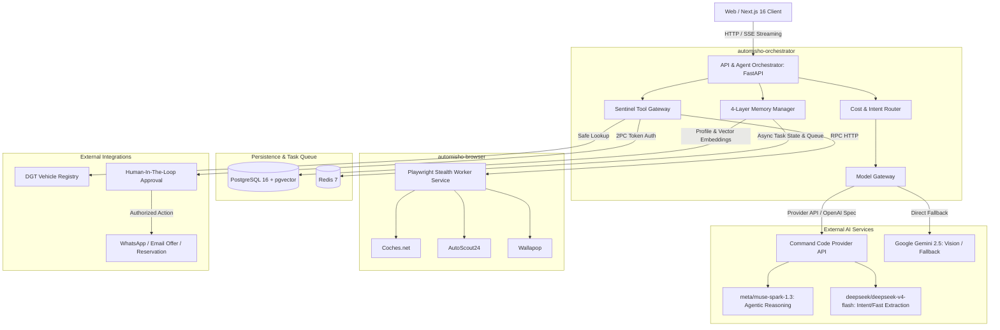
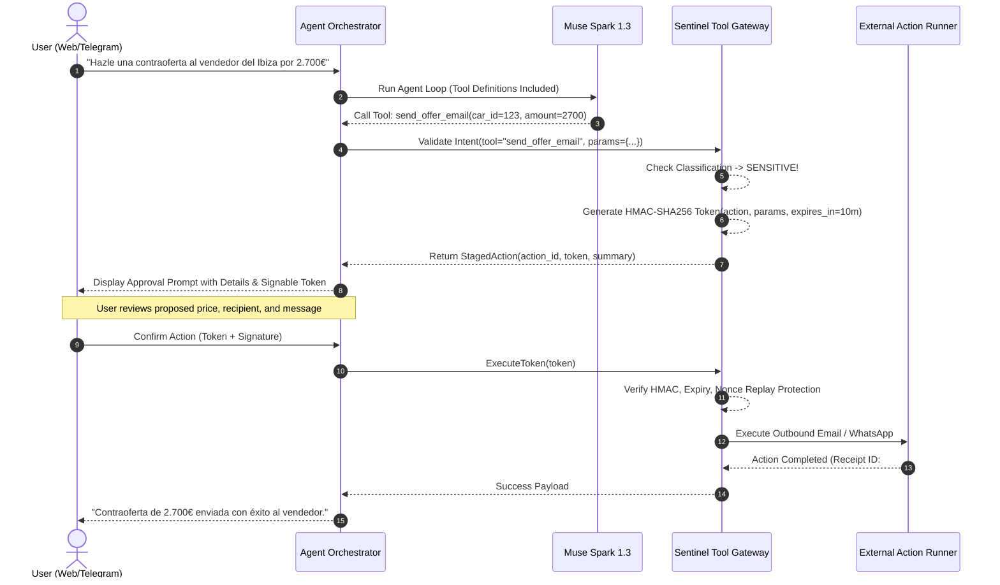
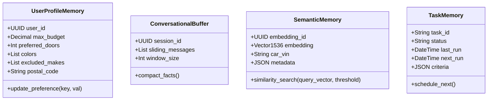

# Technical Design: AutoMisho v2 Agentic Core

**Change ID:** `automisho-v2-agentic-core`  
**Status:** `designed`  
**Date:** 2026-09-16  
**Authors:** Senior Architect & Agentic Core Team  
**Depends on:** `proposal.md`, `specs/*.md`  
**Store Mode:** `openspec`  

---

## 1. System Architecture Overview

AutoMisho v2 transitions from a monolithic FastAPI + Next.js setup with in-process scraping to a decoupled, multi-container agentic runtime.



---

## 2. Model Gateway Component Design

### 2.1 Provider Client Architecture
The `ModelGateway` abstracts LLM communication using an OpenAI-compatible interface backed by `httpx.AsyncClient`.

```python
class ModelTier(str, Enum):
    TIER_1_FAST = "tier_1_fast"          # deepseek/deepseek-v4-flash ($0.15/M in)
    TIER_2_AGENTIC = "tier_2_agentic"    # meta/muse-spark-1.3 ($1.25/M in, $4.25/M out)
    TIER_VISION = "tier_vision"          # google/gemini-2.5-pro or multimodal fallback

class ModelGateway:
    def __init__(self, base_url: str, api_key: str):
        self.base_url = base_url.rstrip("/")
        self.api_key = api_key
        self.circuit_breaker = CircuitBreaker(failure_threshold=3, recovery_timeout=30)
        self.retry_policy = ExponentialBackoff(max_retries=3, base_delay=1.0)

    async def chat_completion(
        self,
        messages: list[dict],
        tools: list[dict] | None = None,
        tier: ModelTier = ModelTier.TIER_2_AGENTIC,
        temperature: float = 0.2
    ) -> AgentResponse:
        ...
```

### 2.2 Intent & Cost-Routing Matrix
1. **Greetings & Trivial Queries**: Routed to `deepseek/deepseek-v4-flash` or local catalog cache. Cost: <$0.0001.
2. **Autonomous Tool Loop & Multi-hop Reasoning**: Routed to `meta/muse-spark-1.3` with system prompt caching enabled. Cost: ~$0.001 - $0.005 / turn.
3. **Vehicle Damage & Photo Verification**: Routed to multimodal endpoint with image attachments.
4. **Resilience**: If Command Code returns HTTP 429, 502, or times out (>12s), the Circuit Breaker trips and automatically cascades to Google GenAI fallback (`gemini-2.5-flash`).

---

## 3. Sentinel Tool Gateway & Two-Phase Commit (2PC)

### 3.1 Tool Classification Matrix
Tools are strictly divided into safe (autonomous) and sensitive (human confirmation required):

| Tool Name | Class | Execution Policy | Side Effects |
|---|---|---|---|
| `search_cars` | Safe | Autonomous execution | Read-only market query |
| `inspect_listing` | Safe | Autonomous execution | Read-only listing fetch |
| `dgt_lookup` | Safe | Autonomous execution | Read-only license plate check |
| `car_vision` | Safe | Autonomous execution | Multimodal image audit |
| `send_whatsapp` | Sensitive | 2PC Signed Token required | Outbound contact with seller |
| `send_offer_email` | Sensitive | 2PC Signed Token required | Binding financial negotiation |
| `reserve_car` | Sensitive | 2PC Signed Token required | Financial deposit action |

### 3.2 Two-Phase Commit (2PC) Token Workflow



---

## 4. 4-Layer Memory System Architecture



### 4.1 Schema DDL for pgvector
```sql
CREATE EXTENSION IF NOT EXISTS vector;

CREATE TABLE IF NOT EXISTS vehicle_semantic_memory (
    id UUID PRIMARY KEY DEFAULT gen_random_uuid(),
    source_url TEXT NOT NULL UNIQUE,
    make VARCHAR(50) NOT NULL,
    model VARCHAR(50) NOT NULL,
    year INT NOT NULL,
    price DECIMAL(10, 2) NOT NULL,
    summary_text TEXT NOT NULL,
    embedding vector(1536),
    metadata JSONB DEFAULT '{}'::jsonb,
    created_at TIMESTAMP WITH TIME ZONE DEFAULT NOW(),
    updated_at TIMESTAMP WITH TIME ZONE DEFAULT NOW()
);

CREATE INDEX IF NOT EXISTS vehicle_embedding_hnsw_idx 
ON vehicle_semantic_memory 
USING hnsw (embedding vector_cosine_ops)
WITH (m = 16, ef_construction = 64);
```

---

## 5. Isolated Browser Worker Service Design

The `automisho-browser` service is a standalone FastAPI application wrapping Playwright in headful/headless mode with `playwright-stealth`.

### 5.1 Endpoints
- `POST /scrape/search`: Accepts `{ "query": "seat ibiza", "max_price": 3000, "sources": ["coches_net", "autoscout24", "wallapop"] }`.
- `POST /scrape/inspect`: Accepts `{ "url": "..." }`. Navigates, extracts raw images, trims tracking query params, extracts seller notes.
- `GET /health`: Health and memory telemetry of active Chromium processes.

### 5.2 Browser Lifecycle & Concurrency
- Chromium instance pooled with persistent user data directories for cookie retention.
- Context recycling every 100 navigation cycles to prevent Chromium memory leaks.
- 15-second strict timeout on navigation with automatic fallback to static DOM parsers if blocked.

---

## 6. Multi-Container Docker Compose Topology

```yaml
version: '3.8'

services:
  automisho-db:
    image: pgvector/pgvector:pg16
    container_name: automisho-db
    environment:
      POSTGRES_DB: automisho
      POSTGRES_USER: ${POSTGRES_USER:-automisho}
      POSTGRES_PASSWORD: ${POSTGRES_PASSWORD:-automisho_secret}
    volumes:
      - automisho_pgdata:/var/lib/postgresql/data
    ports:
      - "5432:5432"
    restart: unless-stopped
    networks:
      - automisho-internal

  automisho-redis:
    image: redis:7-alpine
    container_name: automisho-redis
    ports:
      - "6379:6379"
    volumes:
      - automisho_redisdata:/data
    restart: unless-stopped
    networks:
      - automisho-internal

  automisho-browser:
    build:
      context: ./server/browser_worker
      dockerfile: Dockerfile
    container_name: automisho-browser
    shm_size: '2gb'
    ports:
      - "3001:3000"
    restart: unless-stopped
    networks:
      - automisho-internal

  automisho-orchestrator:
    build:
      context: ./server
      dockerfile: Dockerfile
    container_name: automisho-orchestrator
    environment:
      - DATABASE_URL=postgresql://${POSTGRES_USER:-automisho}:${POSTGRES_PASSWORD:-automisho_secret}@automisho-db:5432/automisho
      - REDIS_URL=redis://automisho-redis:6379/0
      - BROWSER_SERVICE_URL=http://automisho-browser:3000
      - COMMANDCODE_BASE_URL=https://api.commandcode.ai/provider/v1
      - COMMANDCODE_API_KEY=${COMMANDCODE_API_KEY}
      - SENTINEL_SECRET=${SENTINEL_SECRET:-default_dev_secret_change_me}
    ports:
      - "8000:8000"
    depends_on:
      - automisho-db
      - automisho-redis
      - automisho-browser
    restart: unless-stopped
    networks:
      - automisho-internal

  automisho-front:
    build:
      context: ./front
      dockerfile: Dockerfile
    container_name: automisho-front
    environment:
      - BACKEND_URL=http://automisho-orchestrator:8000
      - DATABASE_URL=postgresql://${POSTGRES_USER:-automisho}:${POSTGRES_PASSWORD:-automisho_secret}@automisho-db:5432/automisho
    ports:
      - "3000:3000"
    depends_on:
      - automisho-orchestrator
    restart: unless-stopped
    networks:
      - automisho-internal

networks:
  automisho-internal:
    driver: bridge

volumes:
  automisho_pgdata:
  automisho_redisdata:
```

---

## 7. Test Strategy & TDD Workflow

`server/` adopts Strict TDD (`strict_tdd: true` in SDD config):
1. **T-0**: Bootstrap `pytest`, `pytest-asyncio`, `httpx` in `server/requirements.txt` and create `server/tests/conftest.py`.
2. **Unit Tests**:
   - `test_model_gateway.py`: Mock Command Code Provider API responses, verify circuit breaker, token calculation, fallback logic.
   - `test_sentinel_gateway.py`: Verify HMAC-SHA256 signature, token expiry, rejection of sensitive tool execution without valid token.
   - `test_memory_layers.py`: Unit tests for UserProfile update logic, conversation sliding window compaction, task memory state transitions.
3. **Integration Tests**:
   - `test_agent_flow.py`: Full loop with mocked LLM tool calls validating proper execution and response formatting.
